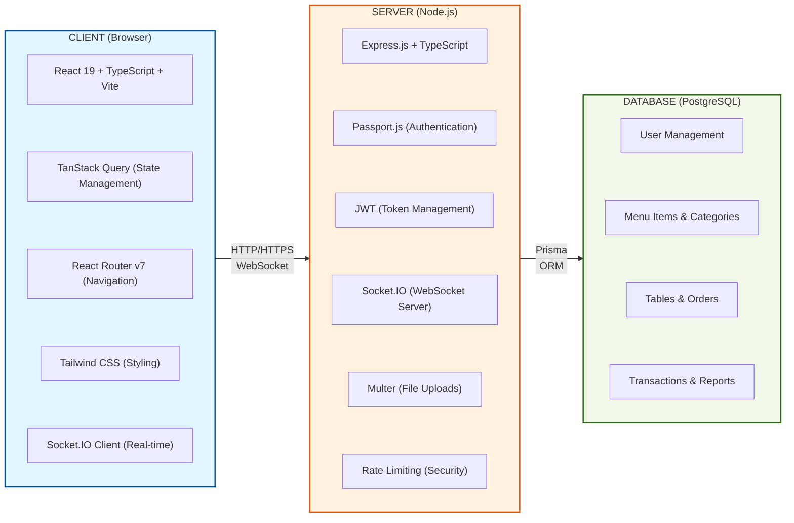
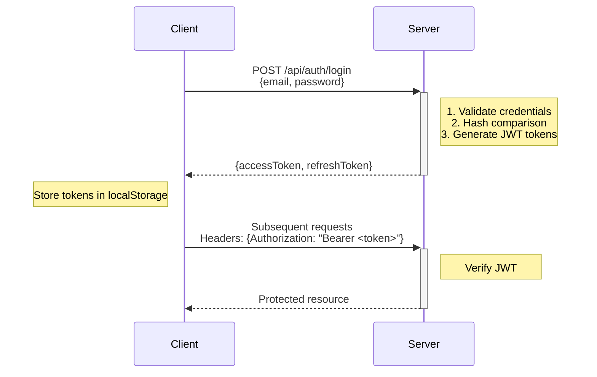
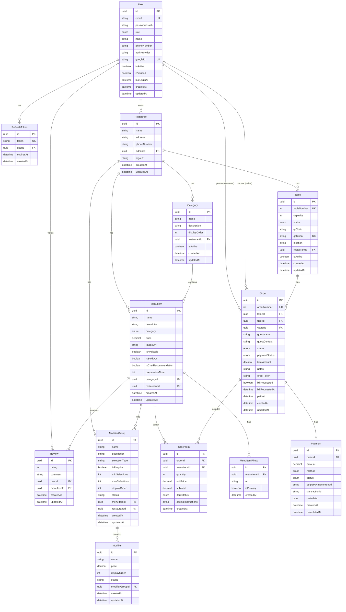
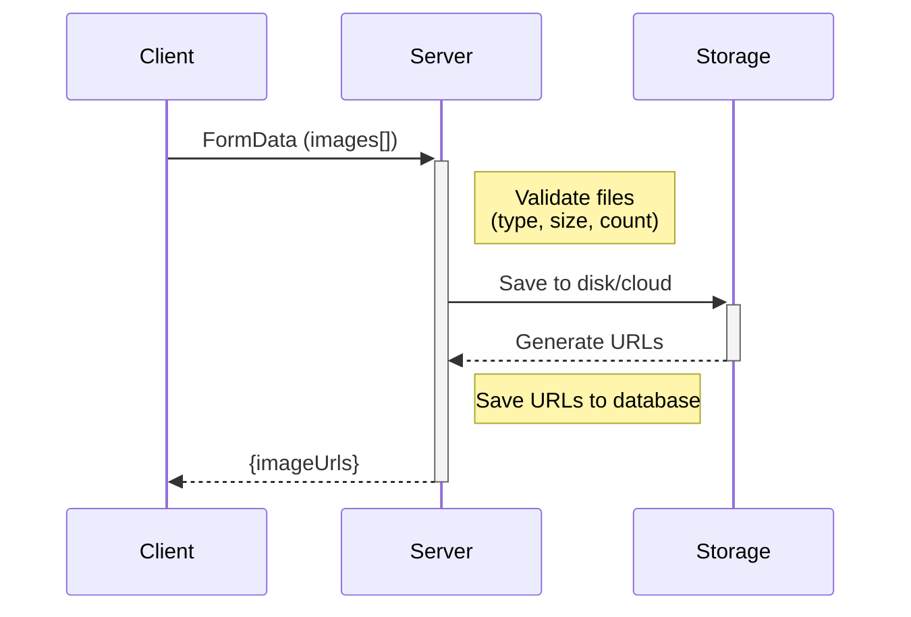

# System Architecture Documentation
# Smart Restaurant Admin

> **Version:** 1.0.0
> **Last Updated:** January 17, 2026
> **Maintainer:** Smart Restaurant Team

---

## 📋 Table of Contents

- [Overview](#overview)
- [Architecture Patterns](#architecture-patterns)
- [Technology Stack](#technology-stack)
- [System Components](#system-components)
- [Data Flow](#data-flow)
- [Authentication & Authorization](#authentication--authorization)
- [Database Schema](#database-schema)
- [Real-Time Communication](#real-time-communication)
- [File Upload Architecture](#file-upload-architecture)
- [Deployment Architecture](#deployment-architecture)
- [Security Architecture](#security-architecture)

---

## 🎯 Overview

The **Smart Restaurant Admin** application follows a modern **three-tier architecture** pattern, separating concerns into:

1. **Presentation Layer** (React Frontend)
2. **Business Logic Layer** (Express Backend)
3. **Data Layer** (PostgreSQL Database)

### High-Level Architecture Diagram

---

## 🏗️ Architecture Patterns

### 1. **MVC (Model-View-Controller)**

The backend follows the MVC pattern:

- **Models:** Prisma schema definitions (`prisma/schema.prisma`)
- **Views:** JSON responses from controllers
- **Controllers:** Handle business logic and request/response (`src/controllers/`)

### 2. **Repository Pattern**

Data access is abstracted through Prisma:
- Services use Prisma Client for database operations
- Centralized database logic in service layer
- Easy to mock for testing

### 3. **Component-Based Architecture (Frontend)**

**Frontend Structure:**
- **components/** - Reusable UI components
  - common/ - Generic components (Button, Modal, etc.)
  - layout/ - Layout components (Sidebar, Header)
  - menuItem/, category/, kitchen/, table/, order/, report/, waiter/, staff/ - Domain-specific components
- **pages/** - Page-level components
- **contexts/** - Global state (Auth, Socket, Toast)
- **hooks/** - Custom React hooks
- **utils/** - Helper functions
- **i18n/** - Internationalization setup
- **locales/** - Language translation files
- **services/** - API communication layer

### 4. **Service Layer Pattern (Backend)**

**Backend Structure:**
- **config/** - Configuration files (Passport, Winston, Redis)
- **routes/** - API endpoint definitions
- **controllers/** - Request handlers
- **services/** - Business logic layer
- **middleware/** - Cross-cutting concerns (auth, validation, uploads)
- **schemas/** - Zod input validation schemas
- **lib/** - Prisma client setup
- **utils/** - Helper functions

---

## 🛠️ Technology Stack

### Frontend Technologies

| Technology | Version | Purpose |
|-----------|---------|---------|
| **React** | 19.2.0 | UI library with modern hooks |
| **TypeScript** | 5.9.3 | Type safety |
| **Vite** | 7.2.4 | Fast build tool |
| **TanStack Query** | 5.62.11 | Server state management & caching |
| **React Router** | 7.1.3 | Client-side routing |
| **Tailwind CSS** | 3.4.17 | Utility-first styling |
| **React Hook Form** | 7.54.2 | Form management |
| **Zod** | 3.24.1 | Schema validation |
| **Socket.IO Client** | 4.8.1 | Real-time updates |
| **Axios** | 1.7.9 | HTTP client |
| **Lucide React** | 0.561.0 | Icon library |
| **Recharts** | 3.6.0 | Data visualization |
| **i18next** | 25.7.4 | Internationalization |

### Backend Technologies

| Technology | Version | Purpose |
|-----------|---------|---------|
| **Node.js** | 18+ | Runtime environment |
| **Express** | 4.21.2 | Web framework |
| **PostgreSQL** | 14+ | Relational database |
| **Prisma** | 7.1.0 | Type-safe ORM |
| **JWT** | 9.0.2 | Authentication tokens |
| **Passport.js** | 0.7.0 | Authentication middleware |
| **Socket.IO** | 4.8.1 | WebSocket server |
| **Multer** | 2.0.2 | File upload handling |
| **BCryptJS** | 2.4.3 | Password hashing |
| **Zod** | 3.24.1 | Runtime validation |
| **QRCode** | 1.5.4 | QR code generation |
| **PDFKit** | 0.17.2 | PDF generation |
| **Winston** | 3.17.0 | Logging |
| **Stripe** | 17.6.0 | Payment processing |
| **Helmet** | 8.0.0 | Security headers |

---

## 🧩 System Components

### Frontend Components

#### 1. **Core Layout**
- `DashboardLayout`: Main layout with sidebar navigation
- `Sidebar`: Navigation menu
- `Header`: Top bar with user profile

#### 2. **Feature Modules**

**Staff Management:**
- `StaffList`: Staff directory
- `StaffForm`: Create/edit staff accounts
- `RoleSelector`: Role-based permissions

**Category Management:**
- `CategoryList`: Category directory
- `CategoryForm`: Create/edit categories

**Menu Management:**
- `MenuItemList`: Display menu items with filters
- `MenuItemForm`: Create/edit menu items
- `ImageGallery`: Multi-image upload (up to 5 photos)
- `ModifierGroups`: Add-ons and customizations

**Table Management:**
- `TableList`: Display tables with status
- `TableForm`: Create/edit tables
- `QRCodeGenerator`: Generate QR codes for tables
- `QRCodeDownload`: Download QR as PNG/PDF

**Order Management:**
- `OrderList`: Active and historical orders
- `OrderDetails`: Order information
- `OrderStatusUpdate`: Change order status

**Reports & Analytics:**
- `RevenueChart`: Revenue trends
- `TopItemsChart`: Best-selling items
- `AnalyticsDashboard`: KPIs and metrics

#### 3. **State Management**

**React Contexts:**
- `AuthContext`: User authentication state
- `SocketContext`: WebSocket connection
- `ToastContext`: Notification system

**TanStack Query:**
- Caching API responses
- Automatic refetching
- Optimistic updates
- Background synchronization

### Backend Components

#### 1. **API Routes**

| Route Module | Endpoints | Purpose |
|-------------|-----------|---------|
| `auth.routes.js` | `/api/auth/*` | Authentication |
| `menuItem.routes.js` | `/api/menu-items/*` | Menu management |
| `category.routes.js` | `/api/categories/*` | Category management |
| `table.routes.js` | `/api/tables/*` | Table & QR management |
| `order.routes.js` | `/api/orders/*` | Order processing |
| `staff.routes.js` | `/api/staff/*` | Staff management |
| `report.routes.js` | `/api/reports/*` | Analytics |
| `waiter.routes.js` | `/api/waiter/*` | Waiter operations |
| `kitchen.routes.js` | `/api/kitchen/*` | Kitchen operations |

#### 2. **Middleware**

- `auth.middleware.js`: JWT verification
- `validation.middleware.js`: Zod schema validation
- `upload.middleware.js`: Multer file upload configuration
- `error.middleware.js`: Centralized error handling
- `rate-limiter.middleware.js`: Rate limiting

#### 3. **Services**

Business logic layer:
- **`AuthService`**: User authentication, JWT token management, password hashing
- **`BillService`**: Bill generation and printing for completed orders
- **`CategoryService`**: Menu category CRUD operations and ordering
- **`KitchenService`**: Kitchen display system (KDS) and order status management
- **`MenuItemPhotoService`**: Image uploads to Supabase (max 5 per item)
- **`MenuItemService`**: Menu item CRUD, modifiers, and fuzzy search
- **`OrderService`**: Order creation, status updates, and history
- **`ProfileService`**: User profile updates and avatar management
- **`PublicMenuService`**: Public menu data for customer applications
- **`QRCodeService`**: QR code generation and download (PNG/PDF)
- **`SocketService`**: Real-time WebSocket communications via Socket.IO
- **`StorageService`**: File storage abstraction for Supabase
- **`TableService`**: Table management, status tracking, and QR integration
- **`StaffService`**: Staff account management and role-based access control
- **`ReportService`**: Revenue analytics and sales performance metrics
- **`WaiterService`**: Waiter operations, order serving, and bill generation

---

## 🔄 Data Flow

### Request-Response Flow

```mermaid
flowchart LR
    Client["Client<br/>(React)"] --> Router["Router<br/>(React Router)"]
    Router --> Middleware["Middleware<br/>(Auth/Validate)"]
    Middleware --> Controller["Controller<br/>(Express)"]
    Controller --> Service["Service<br/>(Business Logic)"]
    Service --> Prisma["Prisma<br/>(ORM)"]
    Prisma --> Database[("PostgreSQL<br/>Database")]
    Database --> Prisma
    Prisma --> Service
    Service --> Controller
    Controller --> Middleware
    Middleware --> Router
    Router --> Client

    style Client fill:#4fc3f7,stroke:#01579b,stroke-width:2px
    style Router fill:#81c784,stroke:#2e7d32,stroke-width:2px
    style Middleware fill:#ffb74d,stroke:#e65100,stroke-width:2px
    style Controller fill:#ba68c8,stroke:#4a148c,stroke-width:2px
    style Service fill:#ff8a65,stroke:#bf360c,stroke-width:2px
    style Prisma fill:#aed581,stroke:#558b2f,stroke-width:2px
    style Database fill:#90caf9,stroke:#1565c0,stroke-width:2px
```

---

## 🔐 Authentication & Authorization

### Authentication Flow

### Token Strategy

**Access Token:**
- **Purpose:** Short-lived authentication
- **Expiry:** 24 hours
- **Storage:** localStorage
- **Usage:** Sent with every API request

**Refresh Token:**
- **Purpose:** Long-lived session renewal
- **Expiry:** 7 days
- **Storage:** localStorage
- **Usage:** Renew expired access tokens

### Authorization Levels

| Role | Permissions |
|------|------------|
| **SUPER_ADMIN** | Full system access |
| **ADMIN** | Manage menu, tables, staff, reports |
| **WAITER** | View orders, update order status |
| **KITCHEN_STAFF** | View and update kitchen orders |

### Role-Based Access Control (RBAC)

**Authorization Middleware Pattern:**

The authorize middleware accepts role parameters and returns a middleware function that checks if the authenticated user's role matches one of the allowed roles. If not authorized, it returns a 403 Forbidden response. Otherwise, it proceeds to the next middleware.

**Usage Example:** Route protection requires both authentication middleware and authorization middleware to restrict access to specific roles (e.g., SUPER_ADMIN, ADMIN).

---

## 🗄️ Database Schema

### Relationships

**Key Relationships:**

**User Relationships:**
- **User → Order (as Customer)**: One-to-Many - A user can place multiple orders
- **User → Order (as Waiter)**: One-to-Many - A waiter can serve multiple orders
- **User → RefreshToken**: One-to-Many - A user can have multiple active refresh tokens
- **User → Restaurant**: One-to-Many - A user (admin) can own multiple restaurants
- **User → Review**: One-to-Many - A user can write multiple reviews

**Restaurant Relationships:**
- **Restaurant → Category**: One-to-Many - A restaurant has multiple categories
- **Restaurant → MenuItem**: One-to-Many - A restaurant has multiple menu items
- **Restaurant → Table**: One-to-Many - A restaurant has multiple tables
- **Restaurant → ModifierGroup**: One-to-Many - A restaurant has multiple modifier groups

**Menu Relationships:**
- **Category → MenuItem**: One-to-Many - A category contains multiple menu items
- **MenuItem → MenuItemPhoto**: One-to-Many - A menu item can have multiple photos (max 5)
- **MenuItem → ModifierGroup**: One-to-Many - A menu item can have multiple modifier groups
- **MenuItem → OrderItem**: One-to-Many - A menu item can be in multiple order items
- **MenuItem → Review**: One-to-Many - A menu item can have multiple reviews
- **ModifierGroup → Modifier**: One-to-Many - A modifier group contains multiple modifiers

**Order Relationships:**
- **Table → Order**: One-to-Many - A table can have multiple orders
- **Order → OrderItem**: One-to-Many - An order contains multiple items
- **Order → Payment**: One-to-One - An order has one payment record

---

## 📡 Real-Time Communication

### WebSocket Architecture

**Socket.IO** enables real-time bidirectional communication for:

1. **Live order updates** (new orders, status changes)
2. **Kitchen display** (order notifications)
3. **Waiter dashboard** (ready-to-serve notifications)
4. **Bill requests** (customer bill notifications)
5. **Payment completion** (order payment updates)

### Architecture Components

#### **Rooms**
- **`kitchen`** - Kitchen staff receive confirmed orders
- **`waiter`** - Waiters receive new orders, ready orders, and bill requests
- **`admin`** - Admins monitor all rooms (kitchen + waiter)

#### **Integration**
- **Redis Pub/Sub** - Receives events from customer app server
- **Express Server** - Socket.IO attached to HTTP server
- **JWT Authentication** - Token-based connection auth

### Socket Events

#### **Server → Client Events**

| Event | Rooms | Payload | Description | Trigger |
|-------|-------|---------|-------------|---------|
| `order:created` | `waiter` | `{ order, timestamp }` | New order from customer | Customer creates order |
| `order:confirmed` | `kitchen` | `{ order, timestamp }` | Order sent to kitchen | Waiter confirms order |
| `order:preparing` | `kitchen`, `waiter` | `{ order, timestamp }` | Kitchen started preparing | Kitchen updates status |
| `order:ready` | `waiter` | `{ order, timestamp }` | Order ready to serve | Kitchen marks ready |
| `order:cancelled` | `kitchen`, `waiter` | `{ order, timestamp }` | Order cancelled | Order cancelled |
| `bill:requested` | `waiter` | `{ orderId, tableNumber, order, timestamp }` | Customer requests bill | Bill request from customer app |
| `payment:completed` | `waiter` | `{ order, orderId, tableNumber, timestamp }` | Payment confirmed | Waiter confirms payment |
| `room:joined` | Individual | `{ room, message }` | Room join confirmation | After joining room |

#### **Client → Server Events**

| Event | Payload | Description | Response |
|-------|---------|-------------|----------|
| `join:room` | `{ role, userId }` | Join room based on role | `room:joined` event |
| `leave:room` | `{ role }` | Leave a room | None |

### Role-Based Room Assignment

**Room Assignment Logic:**
- **KITCHEN_STAFF** → joins `kitchen` room only
- **WAITER** → joins `waiter` room only
- **ADMIN** → joins `admin`, `kitchen`, and `waiter` rooms (can monitor all activities)

### Event Flow Examples

#### **1. New Order Flow**
**Flow:** Customer App → Redis Pub/Sub → Admin Server → Socket.IO → waiter room → Waiter Dashboard

#### **2. Kitchen Order Flow**
**Flow Steps:**
1. Waiter confirms → order:confirmed event → kitchen room → Kitchen Display
2. Kitchen preparing → order:preparing event → kitchen + waiter rooms
3. Kitchen ready → order:ready event → waiter room → Waiter Dashboard

#### **3. Bill Request Flow**
**Flow:** Customer App → Redis → bill:requested event → waiter room → Waiter Dashboard

### Redis Integration

**Channels Subscribed:**
- `order:created` - New orders from customer app
- `order:status:updated` - Order status changes
- `bill:requested` - Bill requests

**Message Handler:**
**Message Handler Logic:**

The Redis message handler routes incoming messages to appropriate Socket.IO emitters based on the channel:
- **order:created** → emits order created event to waiters
- **order:status:updated** → emits status-specific events (confirmed/preparing/ready) to appropriate rooms
- **bill:requested** → emits bill request to waiters

### Client Implementation

#### **Kitchen Hook (`useKitchenSocket`)**
**Kitchen Hook Usage:**

The useKitchenSocket hook accepts event handlers:
- **onOrderConfirmed** - Triggered when new order arrives, plays notification sound and refetches orders
- **onOrderReady** - Triggered when order is marked ready, plays confirmation sound

#### **Waiter Hook (`useWaiterSocket`)**
**Waiter Hook Usage:**

The useWaiterSocket hook handles three main events:
- **onOrderCreated** - New customer order, plays sound and shows notification
- **onOrderReady** - Kitchen finished order, plays sound and refetches data
- **onBillRequested** - Customer requests bill, plays warning sound and shows bill notification

### Connection Configuration

**Connection Settings:**
- **auth** - JWT token for authentication
- **transports** - WebSocket only (no polling)
- **reconnection** - Automatic reconnection enabled
- **reconnectionDelay** - 1 second initial delay
- **reconnectionDelayMax** - 30 seconds maximum delay
- **reconnectionAttempts** - Infinite retry attempts

### Sound Notifications

Events trigger audio feedback:
- **New Order** - `new-order` sound
- **Order Ready** - `order-ready` sound
- **Bill Request** - `warning` sound

---

## 📂 File Upload Architecture

### Multi-Image Upload Strategy

#### Configuration

- **Max files:** 5 images per menu item
- **Allowed formats:** JPG, PNG, WEBP
- **Max file size:** 5MB per image
- **Storage:** Local filesystem (`/uploads`) or cloud (Supabase)

#### Upload Flow

#### Multer Configuration

**Multer Configuration:**

**Storage:**
- Destination: `./uploads/` directory
- Filename: Timestamp + UUID + original extension for uniqueness

**Validation:**
- File size limit: 5MB maximum
- File type filter: Images only (checked via MIME type)
- Rejected files: Returns error for non-image files

---

## 🚀 Deployment Architecture

### Docker Architecture

**Docker Services:**

**Client Service:**
- Build: `./client` directory
- Port: 5173:80
- Environment: VITE_API_URL, VITE_WS_URL
- Network: smart-restaurant-network

**Backend Service:**
- Build: `./server` directory
- Port: 5001:5001
- Environment: DATABASE_URL, JWT_SECRET
- Depends on: postgres service
- Network: smart-restaurant-network

**PostgreSQL Service:**
- Image: postgres:14-alpine
- Database: smart_restaurant
- Environment: DB user and password from env vars
- Volume: postgres_data for data persistence
- Network: smart-restaurant-network

**Network:** Bridge driver
**Volume:** postgres_data for database persistence

### Production Deployment

**Recommended Stack:**
- **Hosting:** AWS EC2 / DigitalOcean / Vercel
- **Database:** AWS RDS PostgreSQL / Supabase
- **File Storage:** AWS S3 / Supabase Storage
- **CDN:** CloudFront / Cloudflare
- **SSL:** Let's Encrypt / AWS Certificate Manager

---

## 🔒 Security Architecture

### Security Layers

1. **Network Security**
   - HTTPS/TLS encryption
   - CORS policy enforcement
   - Rate limiting (100 requests per 15 min)

2. **Authentication Security**
   - BCrypt password hashing (10 rounds)
   - JWT token signing with secret key
   - Token expiration enforcement
   - Refresh token rotation

3. **Authorization Security**
   - Role-based access control
   - Route-level permission checks
   - Resource ownership validation

4. **Input Validation**
   - Zod schema validation
   - SQL injection prevention (Prisma)
   - XSS protection (Helmet)
   - CSRF protection

5. **Data Security**
   - Encrypted database connections
   - Sensitive data hashing
   - Secure file uploads
   - Environment variable protection

### Security Headers (Helmet)

**Helmet Security Headers Configuration:**

**Content Security Policy:**
- defaultSrc: Only self-hosted resources
- styleSrc: Self-hosted + inline styles
- imgSrc: Self-hosted + data URIs + HTTPS images

**HSTS (HTTP Strict Transport Security):**
- Max age: 31536000 seconds (1 year)
- Include subdomains: Yes

---

## 📊 Performance Considerations

### Frontend Optimization
- **Code splitting:** Route-based lazy loading
- **Image optimization:** WebP format, lazy loading
- **Caching:** TanStack Query cache management
- **Bundle size:** Tree-shaking, minification

### Backend Optimization
- **Database indexing:** Indexed foreign keys, search fields
- **Query optimization:** Prisma query optimization
- **Caching:** Redis for session storage (optional)
- **Connection pooling:** PostgreSQL connection pool

---

## 🔗 Related Documentation

- [API Reference](./API_REFERENCE.md)
- [Deployment Guide](./DEPLOYMENT.md)
- [User Guide](./USER_GUIDE.md)
- [Testing Guide](./TESTING.md)

---

**Questions or need clarification?** Contact the development team or refer to the main [README](../README.md).
