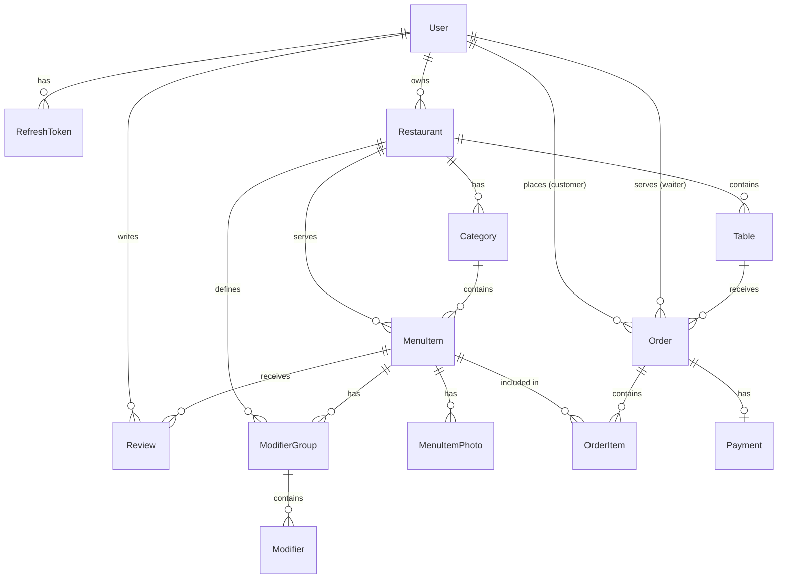

# Database Design Document

## Overview

The Smart Restaurant Admin system uses **PostgreSQL** as its database, managed through **Prisma ORM**. The database schema is defined in `server/prisma/schema.prisma`.

This document describes the current database structure as implemented in the project.

---

## Entity-Relationship Diagram

---

## Tables/Entities

### 1. User

Stores all user accounts including admins, waiters, kitchen staff, and customers.

| Field | Type | Constraints | Description |
|-------|------|-------------|-------------|
| `id` | String (UUID) | PK, Default: uuid() | Unique identifier |
| `email` | String | UNIQUE, NOT NULL | User's email address |
| `passwordHash` | String | NULLABLE | Hashed password (null for OAuth users) |
| `role` | UserRole (Enum) | NOT NULL | User role in the system |
| `name` | String | NULLABLE | Display name |
| `phoneNumber` | String | NULLABLE | Contact phone number |
| `avatarUrl` | String | NULLABLE | Profile picture URL |
| `createdAt` | DateTime | Default: now() | Account creation timestamp |
| `updatedAt` | DateTime | Auto-updated | Last update timestamp |
| `authProvider` | String | Default: "email" | Authentication method |
| `googleId` | String | UNIQUE, NULLABLE | Google OAuth ID |
| `isActive` | Boolean | Default: true | Account active status |
| `isVerified` | Boolean | Default: false | Email verification status |
| `lastLoginAt` | DateTime | NULLABLE | Last login timestamp |
| `passwordResetExpires` | DateTime | NULLABLE | Password reset token expiry |
| `passwordResetToken` | String (VARCHAR 500) | NULLABLE | Password reset token |
| `verificationToken` | String (VARCHAR 500) | NULLABLE | Email verification token |
| `verificationTokenExpiry` | DateTime | NULLABLE | Verification token expiry |

**Indexes:** `email`, `googleId`

**Relationships:**
- Has many `RefreshToken` (one-to-many)
- Has many `Restaurant` as owner (one-to-many)
- Has many `Order` as customer (one-to-many)
- Has many `Order` as waiter (one-to-many)
- Has many `Review` (one-to-many)

---

### 2. RefreshToken

Stores JWT refresh tokens for user sessions.

| Field | Type | Constraints | Description |
|-------|------|-------------|-------------|
| `id` | String (UUID) | PK, Default: uuid() | Unique identifier |
| `token` | String (VARCHAR 500) | UNIQUE, NOT NULL | The refresh token value |
| `userId` | String | FK → User.id, NOT NULL | Owner of the token |
| `expiresAt` | DateTime | NOT NULL | Token expiration time |
| `createdAt` | DateTime | Default: now() | Creation timestamp |
| `updatedAt` | DateTime | Auto-updated | Last update timestamp |

**Indexes:** `userId`, `token`, `expiresAt`

**Constraints:**
- ON DELETE CASCADE (when User is deleted, tokens are deleted)

---

### 3. Restaurant

Stores restaurant information managed by admin users.

| Field | Type | Constraints | Description |
|-------|------|-------------|-------------|
| `id` | String (UUID) | PK, Default: uuid() | Unique identifier |
| `name` | String | NOT NULL | Restaurant name |
| `address` | String | NULLABLE | Physical address |
| `phoneNumber` | String | NULLABLE | Contact phone |
| `adminId` | String | FK → User.id, NOT NULL | Restaurant owner/admin |
| `createdAt` | DateTime | Default: now() | Creation timestamp |
| `updatedAt` | DateTime | Auto-updated | Last update timestamp |
| `logoUrl` | String | NULLABLE | Restaurant logo URL |

**Indexes:** `adminId`

**Relationships:**
- Belongs to `User` (admin)
- Has many `Category` (one-to-many)
- Has many `MenuItem` (one-to-many)
- Has many `ModifierGroup` (one-to-many)
- Has many `Table` (one-to-many)

---

### 4. Table

Represents physical tables in the restaurant.

| Field | Type | Constraints | Description |
|-------|------|-------------|-------------|
| `id` | String (UUID) | PK, Default: uuid() | Unique identifier |
| `tableNumber` | Int | UNIQUE, NOT NULL | Table number for identification |
| `capacity` | Int | NOT NULL | Seating capacity |
| `status` | TableStatus (Enum) | Default: AVAILABLE | Current table status |
| `qrCode` | String | NULLABLE | QR code data/URL |
| `restaurantId` | String | FK → Restaurant.id, NULLABLE | Associated restaurant |
| `createdAt` | DateTime | Default: now() | Creation timestamp |
| `updatedAt` | DateTime | Auto-updated | Last update timestamp |
| `description` | String | NULLABLE | Additional description |
| `location` | String | NULLABLE | Location within restaurant |
| `qrToken` | String (VARCHAR 500) | UNIQUE, NULLABLE | Unique QR token for ordering |
| `qrTokenCreatedAt` | DateTime | NULLABLE | QR token generation time |
| `isActive` | Boolean | Default: true | Table active status |

**Indexes:** `tableNumber`, `status`, `location`, `restaurantId`

**Constraints:**
- ON DELETE CASCADE (when Restaurant is deleted)

**Relationships:**
- Belongs to `Restaurant`
- Has many `Order` (one-to-many)

---

### 5. Category

Groups menu items into categories.

| Field | Type | Constraints | Description |
|-------|------|-------------|-------------|
| `id` | String (UUID) | PK, Default: uuid() | Unique identifier |
| `name` | String | NOT NULL | Category name |
| `description` | String | NULLABLE | Category description |
| `displayOrder` | Int | Default: 0 | Sort order for display |
| `restaurantId` | String | FK → Restaurant.id, NULLABLE | Associated restaurant |
| `createdAt` | DateTime | Default: now() | Creation timestamp |
| `updatedAt` | DateTime | Auto-updated | Last update timestamp |
| `isActive` | Boolean | Default: true | Category active status |

**Indexes:** `restaurantId`

**Constraints:**
- ON DELETE CASCADE (when Restaurant is deleted)

**Relationships:**
- Belongs to `Restaurant`
- Has many `MenuItem` (one-to-many)

---

### 6. MenuItem

Represents dishes/items on the restaurant menu.

| Field | Type | Constraints | Description |
|-------|------|-------------|-------------|
| `id` | String (UUID) | PK, Default: uuid() | Unique identifier |
| `name` | String | NOT NULL | Item name |
| `description` | String | NULLABLE | Item description |
| `price` | Decimal(10,2) | NOT NULL | Base price |
| `imageUrl` | String | NULLABLE | Primary image URL |
| `isAvailable` | Boolean | Default: true | Availability status |
| `isSoldOut` | Boolean | Default: false | Sold out status |
| `isChefRecommendation` | Boolean | Default: false | Chef's pick flag |
| `preparationTime` | Int | NULLABLE | Prep time in minutes |
| `categoryId` | String | FK → Category.id, NOT NULL | Item category |
| `restaurantId` | String | FK → Restaurant.id, NULLABLE | Associated restaurant |
| `createdAt` | DateTime | Default: now() | Creation timestamp |
| `updatedAt` | DateTime | Auto-updated | Last update timestamp |

**Indexes:** `isAvailable`, `categoryId`, `restaurantId`

**Constraints:**
- ON DELETE CASCADE (when Restaurant is deleted)

**Relationships:**
- Belongs to `Category`
- Belongs to `Restaurant`
- Has many `MenuItemPhoto` (one-to-many)
- Has many `ModifierGroup` (one-to-many)
- Has many `OrderItem` (one-to-many)
- Has many `Review` (one-to-many)

---

### 7. MenuItemPhoto

Stores additional photos for menu items.

| Field | Type | Constraints | Description |
|-------|------|-------------|-------------|
| `id` | String (UUID) | PK, Default: uuid() | Unique identifier |
| `menuItemId` | String | FK → MenuItem.id, NOT NULL | Associated menu item |
| `url` | String | NOT NULL | Photo URL |
| `isPrimary` | Boolean | Default: false | Primary photo flag |
| `createdAt` | DateTime | Default: now() | Creation timestamp |

**Indexes:** `menuItemId`, composite(`menuItemId`, `isPrimary`)

**Constraints:**
- ON DELETE CASCADE (when MenuItem is deleted)

---

### 8. ModifierGroup

Groups modifiers (add-ons/options) for menu items.

| Field | Type | Constraints | Description |
|-------|------|-------------|-------------|
| `id` | String (UUID) | PK, Default: uuid() | Unique identifier |
| `name` | String | NOT NULL | Group name (e.g., "Size", "Toppings") |
| `description` | String | NULLABLE | Group description |
| `selectionType` | String | Default: "multiple" | "single" or "multiple" selection |
| `isRequired` | Boolean | Default: false | Whether selection is mandatory |
| `minSelections` | Int | Default: 0, NULLABLE | Minimum selections required |
| `maxSelections` | Int | NULLABLE | Maximum selections allowed |
| `displayOrder` | Int | Default: 0 | Sort order |
| `status` | String | Default: "active" | Group status |
| `menuItemId` | String | FK → MenuItem.id, NOT NULL | Associated menu item |
| `restaurantId` | String | FK → Restaurant.id, NULLABLE | Associated restaurant |
| `createdAt` | DateTime | Default: now() | Creation timestamp |
| `updatedAt` | DateTime | Auto-updated | Last update timestamp |

**Indexes:** `menuItemId`, `restaurantId`, `status`

**Constraints:**
- ON DELETE CASCADE (when MenuItem or Restaurant is deleted)

**Relationships:**
- Belongs to `MenuItem`
- Belongs to `Restaurant`
- Has many `Modifier` (one-to-many)

---

### 9. Modifier

Individual modifier options within a modifier group.

| Field | Type | Constraints | Description |
|-------|------|-------------|-------------|
| `id` | String (UUID) | PK, Default: uuid() | Unique identifier |
| `name` | String | NOT NULL | Modifier name (e.g., "Extra Cheese") |
| `price` | Decimal(10,2) | Default: 0 | Additional price |
| `createdAt` | DateTime | Default: now() | Creation timestamp |
| `updatedAt` | DateTime | Auto-updated | Last update timestamp |
| `displayOrder` | Int | Default: 0 | Sort order |
| `modifierGroupId` | String | FK → ModifierGroup.id, NOT NULL | Parent group |
| `status` | String | Default: "active" | Modifier status |

**Indexes:** `modifierGroupId`, `status`

**Constraints:**
- ON DELETE CASCADE (when ModifierGroup is deleted)

---

### 10. Order

Represents customer orders.

| Field | Type | Constraints | Description |
|-------|------|-------------|-------------|
| `id` | String (UUID) | PK, Default: uuid() | Unique identifier |
| `orderNumber` | Int | UNIQUE, Auto-increment | Human-readable order number |
| `tableId` | String | FK → Table.id, NOT NULL | Table where order was placed |
| `userId` | String | FK → User.id, NULLABLE | Customer (if registered) |
| `guestName` | String | NULLABLE | Guest customer name |
| `guestContact` | String | NULLABLE | Guest contact info |
| `waiterId` | String | FK → User.id, NULLABLE | Assigned waiter |
| `status` | OrderStatus (Enum) | Default: PENDING | Order processing status |
| `totalAmount` | Decimal(10,2) | Default: 0 | Total order amount |
| `paymentStatus` | PaymentStatus (Enum) | Default: UNPAID | Payment status |
| `notes` | String | NULLABLE | Special instructions |
| `createdAt` | DateTime | Default: now() | Order creation time |
| `updatedAt` | DateTime | Auto-updated | Last update timestamp |
| `paidAt` | DateTime | NULLABLE | Payment completion time |
| `billRequested` | Boolean | Default: false | Bill request flag |
| `billRequestedAt` | DateTime | NULLABLE | Bill request timestamp |
| `orderToken` | String | NULLABLE | Token for guest access |

**Indexes:** `orderNumber`, composite(`tableId`, `status`), `status`, `createdAt`, `userId`, `waiterId`

**Relationships:**
- Belongs to `Table`
- Belongs to `User` (customer) - optional
- Belongs to `User` (waiter) - optional
- Has many `OrderItem` (one-to-many)
- Has one `Payment` (one-to-one)

---

### 11. OrderItem

Individual items within an order.

| Field | Type | Constraints | Description |
|-------|------|-------------|-------------|
| `id` | String (UUID) | PK, Default: uuid() | Unique identifier |
| `orderId` | String | FK → Order.id, NOT NULL | Parent order |
| `menuItemId` | String | FK → MenuItem.id, NOT NULL | Ordered menu item |
| `quantity` | Int | NOT NULL | Number of items |
| `unitPrice` | Decimal(10,2) | NOT NULL | Price per unit at order time |
| `subtotal` | Decimal(10,2) | NOT NULL | Total for this line item |
| `itemStatus` | OrderItemStatus (Enum) | Default: QUEUED | Kitchen status |
| `specialInstructions` | String | NULLABLE | Special requests |
| `createdAt` | DateTime | Default: now() | Creation timestamp |

**Indexes:** `orderId`, `menuItemId`

**Constraints:**
- ON DELETE CASCADE (when Order is deleted)

**Relationships:**
- Belongs to `Order`
- Belongs to `MenuItem`

---

### 12. Payment

Stores payment information for orders.

| Field | Type | Constraints | Description |
|-------|------|-------------|-------------|
| `id` | String (UUID) | PK, Default: uuid() | Unique identifier |
| `orderId` | String | FK → Order.id, UNIQUE, NOT NULL | Associated order (1:1) |
| `amount` | Decimal(10,2) | NOT NULL | Payment amount |
| `method` | PaymentMethod (Enum) | NOT NULL | Payment method used |
| `status` | PaymentTransactionStatus (Enum) | Default: PENDING | Transaction status |
| `stripePaymentIntentId` | String | UNIQUE, NULLABLE | Stripe payment intent ID |
| `transactionId` | String | NULLABLE | External transaction ID |
| `metadata` | Json | NULLABLE | Additional payment data |
| `createdAt` | DateTime | Default: now() | Creation timestamp |
| `completedAt` | DateTime | NULLABLE | Payment completion time |

**Indexes:** `orderId`, `stripePaymentIntentId`, `status`

---

### 13. Review

Customer reviews for menu items.

| Field | Type | Constraints | Description |
|-------|------|-------------|-------------|
| `id` | String (UUID) | PK, Default: uuid() | Unique identifier |
| `rating` | Int | NOT NULL | Rating value |
| `comment` | String | NOT NULL | Review text |
| `userId` | String | FK → User.id, NOT NULL | Author |
| `menuItemId` | String | FK → MenuItem.id, NOT NULL | Reviewed item |
| `createdAt` | DateTime | Default: now() | Creation timestamp |
| `updatedAt` | DateTime | Auto-updated | Last update timestamp |

**Indexes:** `menuItemId`, `userId`, `createdAt`

**Constraints:**
- UNIQUE composite(`userId`, `menuItemId`) - One review per user per item
- ON DELETE CASCADE (when User or MenuItem is deleted)

---

## Enumerations

### UserRole
| Value | Description |
|-------|-------------|
| `SUPER_ADMIN` | System administrator |
| `ADMIN` | Restaurant owner/manager |
| `WAITER` | Wait staff |
| `KITCHEN_STAFF` | Kitchen personnel |
| `CUSTOMER` | Registered customer |
| `GUEST` | Unregistered guest user |

### TableStatus
| Value | Description |
|-------|-------------|
| `AVAILABLE` | Table is free |
| `OCCUPIED` | Table is in use |
| `RESERVED` | Table is reserved |

### OrderStatus
| Value | Description |
|-------|-------------|
| `PENDING` | Order submitted, awaiting confirmation |
| `CONFIRMED` | Order confirmed by staff |
| `PREPARING` | Kitchen is preparing the order |
| `READY` | Food is ready for service |
| `SERVED` | Food has been served to customer |
| `COMPLETED` | Order fully completed |
| `BILL_REQUESTED` | Customer requested the bill |
| `CANCELLED` | Order was cancelled |

### PaymentStatus
| Value | Description |
|-------|-------------|
| `UNPAID` | Payment not yet made |
| `PENDING` | Payment in progress |
| `PAID` | Payment completed |
| `FAILED` | Payment failed |

### PaymentMethod
| Value | Description |
|-------|-------------|
| `CASH` | Cash payment |
| `CARD` | Credit/debit card |
| `E_WALLET` | Electronic wallet |

### PaymentTransactionStatus
| Value | Description |
|-------|-------------|
| `PENDING` | Transaction initiated |
| `SUCCESS` | Transaction successful |
| `FAILED` | Transaction failed |
| `REFUNDED` | Transaction refunded |

### OrderItemStatus
| Value | Description |
|-------|-------------|
| `QUEUED` | Item queued for kitchen |
| `COOKING` | Item being prepared |
| `READY` | Item ready for serving |

---

## Key Relationships Summary

| Relationship | Type | Description |
|-------------|------|-------------|
| User → Restaurant | One-to-Many | Admin owns multiple restaurants |
| User → Order (customer) | One-to-Many | Customer places multiple orders |
| User → Order (waiter) | One-to-Many | Waiter serves multiple orders |
| Restaurant → Table | One-to-Many | Restaurant has multiple tables |
| Restaurant → Category | One-to-Many | Restaurant has multiple categories |
| Restaurant → MenuItem | One-to-Many | Restaurant serves multiple items |
| Category → MenuItem | One-to-Many | Category contains multiple items |
| MenuItem → MenuItemPhoto | One-to-Many | Item has multiple photos |
| MenuItem → ModifierGroup | One-to-Many | Item has multiple modifier groups |
| ModifierGroup → Modifier | One-to-Many | Group contains multiple modifiers |
| Table → Order | One-to-Many | Table receives multiple orders |
| Order → OrderItem | One-to-Many | Order contains multiple items |
| Order → Payment | One-to-One | Order has one payment record |
| User → Review | One-to-Many | User writes multiple reviews |
| MenuItem → Review | One-to-Many | Item receives multiple reviews |

---

## Data Integrity Constraints

### Cascade Deletions
The following relationships have cascade delete enabled:
- `User` → `RefreshToken`: Deleting a user removes all their refresh tokens
- `Restaurant` → `Table`: Deleting a restaurant removes all its tables
- `Restaurant` → `Category`: Deleting a restaurant removes all its categories
- `Restaurant` → `MenuItem`: Deleting a restaurant removes all its menu items
- `Restaurant` → `ModifierGroup`: Deleting a restaurant removes all its modifier groups
- `MenuItem` → `MenuItemPhoto`: Deleting an item removes all its photos
- `MenuItem` → `ModifierGroup`: Deleting an item removes all its modifier groups
- `MenuItem` → `Review`: Deleting an item removes all its reviews
- `ModifierGroup` → `Modifier`: Deleting a group removes all its modifiers
- `Order` → `OrderItem`: Deleting an order removes all its items
- `User` → `Review`: Deleting a user removes all their reviews

### Unique Constraints
- `User.email`: Email must be unique across all users
- `User.googleId`: Google ID must be unique (for OAuth users)
- `Table.tableNumber`: Table numbers must be unique
- `Table.qrToken`: QR tokens must be unique
- `Order.orderNumber`: Order numbers are auto-incremented and unique
- `Payment.orderId`: Each order can have only one payment
- `Payment.stripePaymentIntentId`: Stripe intent IDs must be unique
- `Review(userId, menuItemId)`: One review per user per menu item

---

## Database Information

- **Database Provider:** PostgreSQL
- **ORM:** Prisma
- **Schema Location:** `server/prisma/schema.prisma`
